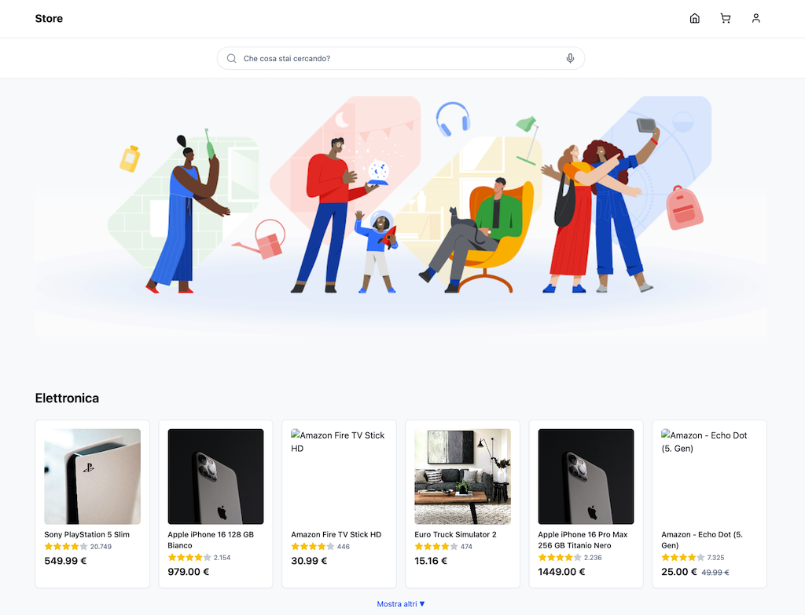

# Next.js Google Shopping 🛍

Welcome to the **Next.js Google Shopping** repository! This project aims to integrate **Next.js** with Google Shopping functionality, offering a foundation for building modern and performant e-commerce experiences.




## ✨ Overview

- **Next.js-based**: Enjoy the benefits of server-side rendering and automatic static optimization.  
- **Google Shopping Integration**: Designed to help you list products and manage data feeds for Google Shopping.  
- **Modular & Extensible**: Easily add or remove components to fit your e-commerce requirements.

## 📂 Project Structure

```
nextjs-google-shopping/
├─ components/         # Reusable UI components
├─ pages/              # Next.js pages
├─ public/             # Public assets (images, icons)
├─ styles/             # Global or modular CSS
├─ utils/              # Helper functions, API calls, etc.
├─ package.json
└─ ...
```

## 🏁 Getting Started

1. **Clone the Repo**
   ```
   git clone https://github.com/alexgenovese/nextjs-google-shopping.git
   cd nextjs-google-shopping
   ```

2. **Install Dependencies**
   ```
   npm install
   # or
   yarn install
   ```

3. **Run Development Server**
   ```
   npm run dev
   # or
   yarn dev
   ```
   Access the site at [http://localhost:3000](http://localhost:3000).

4. **Build for Production**
   ```
   npm run build
   npm run start
   ```

## ⚙️ Main Features

- **Google Shopping Data Feeds**: Set up and manage product listing data for Google Merchant Center.  
- **SEO-Friendly**: Next.js optimizes your pages for search engines.  
- **Responsive Layout**: Works seamlessly on desktops, tablets, and mobile devices.  
- **Scalable Architecture**: Easily add pages, APIs, or third-party integrations as your store grows.

## 🎨 Customization

- **Update Content**: Swap out product details, texts, and images to match your branding.  
- **Change Styling**: Edit or add global and modular CSS in the `styles/` directory.  
- **Extend Functionality**: Add new APIs or external integrations in the `utils/` folder or within the Next.js API routes (`pages/api/`).

## 🌐 Deployment

You can deploy this Next.js app on:
- **Vercel** (official Next.js hosting)  
- **Netlify**  
- **Your Custom Node.js Hosting**  

After building, just upload the `.next` folder or follow your hosting provider's instructions.

## 🤝 Contributing

1. **Fork** the repo  
2. Create a new **branch** (e.g., `feature/my-improvement`)  
3. **Commit** your changes  
4. Open a **Pull Request**  

We welcome any contributions—bug fixes, optimizations, or new features!

## ⚖️ License

This project is licensed under the **MIT License**, so feel free to use, modify, and distribute it for personal or commercial purposes.

---

[1]: https://github.com/alexgenovese/nextjs-google-shopping

Citations:
[1] https://github.com/alexgenovese/nextjs-google-shopping


